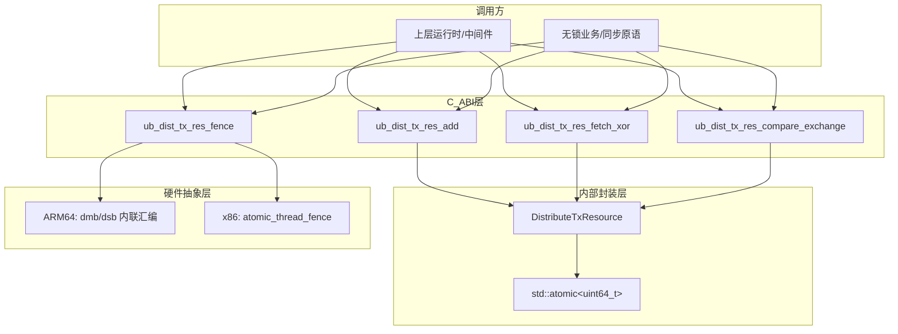
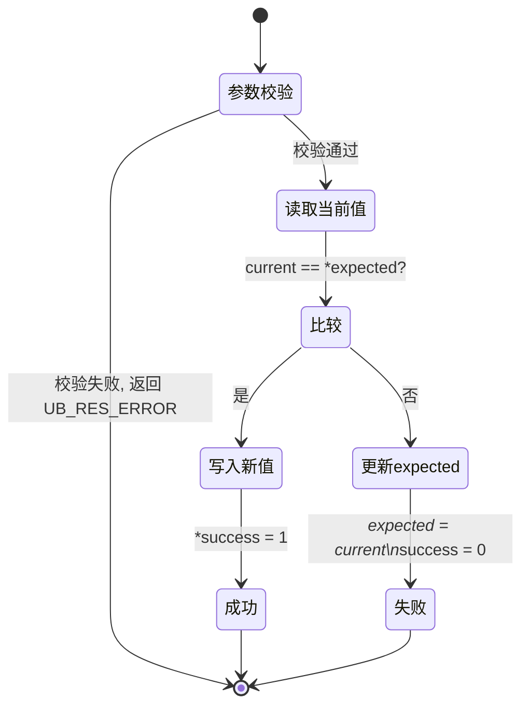

**状态 (Status):** Draft

**作者 (Authors):** @davidhwang

**创建日期 (Created):** 2026-07-24

**更新日期 (Updated):** 2026-07-24

**相关 Issue/PR:** 

***

# 1. 概述

## 1.1 简介

本提案为 ubs-atomic 库的分布式事务资源模块（`ub_dist_tx_res`）新增四类原子原语接口：统一内存屏障 `fence`、无 fetch 原子加法 `add`、原子异或 `fetch_xor`、原子比较并交换 `compare_exchange`（CAS）。模块在既有 `init`/`set`/`get`/`fetch_add` 接口的基础上，补齐 C11/C++11 `std::atomic` 语义中常用的 RMW（Read-Modify-Write）原语与内存序控制原语，对外仍以 C ABI 导出，直接操作调用方提供的 8 字节对齐 `uint64_t` 共享内存地址。本提案的核心价值在于为上层业务使用无锁数据结构与分布式同步原语提供完整、轻量的底层支撑。

## 1.2 动机

ubs-atomic 面向多节点分布式共享内存环境，其 `ub_dist_tx_res` 模块当前仅提供 `init`/`set`/`get`/`fetch_add` 四个接口，在支撑上层 MPI 运行时与无锁业务场景时存在明显缺口：

- **缺少内存屏障原语**：MPI 标准中 `MPI_Win_lock`/`MPI_Win_unlock` 要求在 lock 进入与 unlock 退出时刻建立内存序约束，确保 RMA 窗口内的写操作对其他进程可见、读操作能看到最新值。当前模块无对外 fence 接口，调用方只能自行内联 `dmb`/`dsb` 汇编，导致：（1）平台相关代码散落各处，难以维护；（2）编译器优化（`-O2`）下，无屏障保护的轮询循环会被 GCC 判定为 UB 并整体删除。
- **缺少无 fetch 原子加法**：`MPI_Accumulate(MPI_SUM)` 等场景仅需累加、不关心旧值。当前只能使用 `fetch_add`。
- **缺少原子位运算**：无锁标志位翻转、位图维护等场景需要原子 XOR。当前模块无任何位运算 RMW 原语，调用方只能退化为 `fetch_add` 仿真或加锁，丧失原子优势。
- **缺少原子条件更新**：无锁队列、自旋锁、状态机转换等核心场景依赖 CAS。当前模块无 CAS 接口，无法支撑 `MPI_Compare_and_swap` 及上层无锁算法。

不做此提案的影响：上层无法基于 ubs-atomic 完整实现，调用方被迫自行拼凑平台相关汇编或引入更重的锁机制，既损害性能，也增加正确性风险与维护成本。

## 1.3 目标

**目标：**

- 新增统一内存屏障接口 `ub_dist_tx_res_fence(order)`，支持 5 种内存序语义（RELAXED/ACQUIRE/RELEASE/ACQ\_REL/SEQ\_CST），对齐 C11 `atomic_thread_fence(order)` 心智模型。
- 新增无 fetch 原子加法接口 `ub_dist_tx_res_add(handle, value)`，允许硬件优化为更轻量指令。
- 新增原子异或接口 `ub_dist_tx_res_fetch_xor(handle, value, out_val)`，返回旧值。
- 新增原子比较并交换接口 `ub_dist_tx_res_compare_exchange(handle, expected, desired, success)`，使用 `compare_exchange_strong` 语义（成功 acq\_rel / 失败 acquire）。
- 保持 C ABI 兼容，支持 C/C++ 调用；ARM64 使用内联汇编生成精确屏障指令。
- 对既有 `init`/`set`/`get`/`fetch_add` 接口与调用方零冲击。

**非目标：**

- 不修改既有 `init`/`set`/`get`/`fetch_add` 的函数签名与内存序语义。
- 不提供 128 位原子操作、`fetch_or`/`fetch_and`/`fetch_sub` 等其他 RMW 变体（可后续提案扩展）。
- 不实现跨节点 NC 内存的硬件原子事务保证（依赖 ub 共享内存硬件实现，超出本模块范围）。
- 不提供 fence 的"地址绑定/上下文校验"能力（当前为线程级 fence，不绑定特定地址）。
- 不变更模块的共享内存生命周期管理职责（仍由调用方负责分配、映射、释放）。

# 2. 用例分析

本提案面向以下核心场景，各场景的功能点、性能指标与 DFX 要求如下。

## 2.1 共享内存同步与内存序约束（fence）

- **功能点**：为多线程/多进程共享内存访问提供统一的内存序约束原语，对齐 C11 `atomic_thread_fence(order)` 心智模型。典型通用场景：
  - **生产者-消费者可见性**：writer 写数据后执行 `fence(RELEASE)` 保证写顺序，reader 读到标志后执行 `fence(ACQUIRE)` 确保看到最新数据。
  - **双向同步点**：双方均需读写共享状态时使用 `fence(ACQ_REL)`，如屏障同步、自旋锁临界区边界。
  - **全局一致序**：多观察者需对同一组写操作看到一致顺序时使用 `fence(SEQ_CST)`。
  - **仅阻止编译器重排**：无需硬件保序但需阻止编译器寄存器缓存与重排时使用 `fence(RELAXED)`，典型如轮询循环防止被优化删除。
- **性能指标**：无强制性能指标，高频调用需避免不必要的全屏障，按场景选择最轻量语义。
- **DFX**：可测试性要求每种语义生成可识别的机器码（objdump 验证 `dmb`/`dsb`）；无跨平台兼容性要求。

## 2.2 分布式计数器累加（add）

- **功能点**：多节点对同一共享计数器执行原子累加，不关心旧值，典型如全局事件计数、配额扣减、统计聚合。
- **性能指标**：无强制性能指标，与已有fetch\_add接口保持持平。
- **DFX**：可维护性要求与 `fetch_add` 接口风格一致；可测试性要求溢出按 `uint64_t` 模算术回绕，不触发未定义行为。

## 2.3 无锁标志位翻转（fetch\_xor）

- **功能点**：原子位翻转，用于无锁状态机、位图维护、自反性标志（`a ^ b ^ b == a`）。
- **性能指标**：无强制性能指标。
- **DFX**：可测试性要求返回旧值正确、异或结果正确；可靠性要求并发下无位丢失。

## 2.4 无锁条件更新（compare\_exchange）

- **功能点**：CAS 是无锁队列、自旋锁、状态机转换的核心原语。匹配时替换为新值并成功，不匹配时回填当前值以便调用方重试。
- **性能指标**：无强制性能指标。
- **DFX**：可测试性要求成功/失败两条路径均可覆盖；可靠性要求并发 CAS 自旋锁计数无丢失；兼容性要求返回值语义清晰（区分"函数调用成功"与"CAS 匹配成功"）。

## 2.5 通用约束

- **使用限制**：所有带 `handle` 参数的接口要求 8 字节对齐；`handle` 指向的内存在所有参与方之间可见且生命周期由调用方保证。
- **可观测性**：参数校验失败时通过 `ATOMIC_LOG(LOG_LEVEL_ERROR, ...)` 输出诊断信息，可经 `ub_atomic_register_log_func` 接入调用方日志系统。

# 3. 方案设计

## 3.1 总体方案

延续 `ub_dist_tx_res` 模块既有的"无状态临时对象 + `reinterpret_cast`"实现模式：每次调用均将调用方传入的 `uint64_t *` 共享内存地址 `reinterpret_cast` 为 `std::atomic<uint64_t> *` 构造临时 `DistributeTxResource` 包装对象，在其上调用对应的 `std::atomic` 方法。该模式的合法性依据是 C++ 标准允许在同一线程内对同一对齐地址反复构造 `std::atomic<T>*`，只要地址对齐且无 data race。

整体架构分为三层：



**关键设计决策：**

| 决策点             | 选择                                             | 理由                                                |
| --------------- | ---------------------------------------------- | ------------------------------------------------- |
| fence 接口形式      | 单接口 + 枚举参数                                     | 对齐 C11 `atomic_thread_fence(order)` 心智模型，API 面积小； |
| `add` 内存序       | `release`                                      | 无需读回旧值，不需要 acquire；release 保证之前的写对 acquire 读者可见   |
| `fetch_xor` 内存序 | `acq_rel`                                      | RMW 读取旧值需 acquire，写入需 release，双向同步                |
| CAS 实现          | `compare_exchange_strong`                      | 避免伪失败（spurious failure），简化调用方重试逻辑                 |
| CAS 返回值设计       | 函数返回调用状态 + `success` 出参表示匹配                    | 二值错误码与既有接口一致；`success` 独立表达 CAS 匹配结果，避免歧义         |
| ARM64 fence 指令  | 精细 `dmb ishld`/`dmb ishst`/`dmb ish`/`dsb ish` | 区分读/写/双向/全局屏障，避免一律使用最重的 `dsb ish` 损失性能            |
| 参数校验            | 非空 + 8 字节对齐                                    | 防止未定义行为，快速失败；与既有接口一致                              |
| 错误码             | `UB_RES_OK` / `UB_RES_ERROR`                   | 简洁二值，不暴露内部细节                                      |

**fence 执行流程（文字描述）：**

1. 接收 `order` 参数。
2. `switch(order)` 分派：
   - `RELAXED`：`asm volatile("" ::: "memory")`（仅编译器屏障）。
   - `ACQUIRE`：ARM64 `dmb ishld`；
   - `RELEASE`：ARM64 `dmb ishst`；
   - `ACQ_REL`：ARM64 `dmb ish`；
   - `SEQ_CST`：ARM64 `dsb ish`；
   - `default`：返回 `UB_RES_ERROR`。
3. 返回 `UB_RES_OK`。

**CAS 状态机：**



## 3.2 技术选型

| 备选方案                                                          | 优势             | 劣势                                                       | 是否采纳                                                           |
| ------------------------------------------------------------- | -------------- | -------------------------------------------------------- | -------------------------------------------------------------- |
| **fence：多独立函数**（`fence_acquire`/`fence_release`/...）          | 调用方无需记忆枚举      | API 面积大；与 C11 `atomic_thread_fence(order)` 心智不一致；难以扩展新语义 | 否，采用单接口+枚举，旧名用宏兼容                                              |
| **fence：一律使用** **`dsb ish`（最保守）**                             | 实现简单，绝对安全      | 高频热路径性能损失；无法区分单向屏障                                       | 否，采用精细 `dmb` 指令，`SEQ_CST` 才用 `dsb ish`                         |
| **fence：复用** **`util.h`** **的** **`arm_sfence`/`arm_lfence`** | 已有封装           | 两者实现相同均为 `dsb ish`，无法表达 5 种语义；`arm_lfence` 当前未被调用        | 否，新增参数化实现                                                      |
| **`add`：用** **`fetch_add`** **丢弃返回值**                         | 复用现有代码         | 若编译器未识别返回值未使用，仍生成 `LDADD`；语义偏强（acq\_rel）                 | 部分采纳：内部仍调 `fetch_add`，但用 `release` 语义并在 `-O2` 下由编译器优化为 `STADD` |
| **`add`：内联汇编** **`stadd`**                                    | 绝对保证生成 `STADD` | 平台相关；与 `std::atomic` 抽象不一致；可移植性差                         | 否，优先依赖编译器优化；若优化不达预期再考虑                                         |
| **`fetch_xor`：用** **`fetch_or`+`fetch_and`** **仿真**           | 无需新指令          | 多次 RMW 破坏原子性；性能差                                         | 否，直接使用 `std::atomic::fetch_xor`                                |
| **CAS：`compare_exchange_weak`**                               | 循环场景下可避免重试开销   | 可能伪失败，调用方需自行循环；语义复杂                                      | 否，采用 `strong` 避免伪失败                                            |
| **CAS：函数返回值即表示匹配**                                            | 接口简洁           | 与既有二值错误码风格不一致；无法区分"调用失败"与"匹配失败"                          | 否，采用函数返回调用状态 + `success` 出参                                    |

## 3.3 功能与性能设计

### 3.3.1 内部封装类扩展

在既有 `DistributeTxResource` 类上新增方法：

```cpp
class DistributeTxResource {
    std::atomic<uint64_t> *ptr;
public:
    explicit DistributeTxResource(std::atomic<uint64_t> *address) : ptr(address) {}
    void init();                                         // store(0, relaxed)
    void set(uint64_t);                                  // store(value, release)
    uint64_t get();                                      // load(acquire)
    uint64_t fetch_add(uint64_t);                        // fetch_add(value, acq_rel)
    void add(uint64_t);                                  // fetch_add(value, release)
    uint64_t fetch_xor(uint64_t);                        // fetch_xor(value, acq_rel)
    bool compare_exchange(uint64_t *expected, uint64_t desired);
    // compare_exchange_strong(*expected, desired, acq_rel, acquire)
};
```

### 3.3.2 各接口内存序与硬件指令映射

| 接口                 | 内存序              | ARM64 LSE 指令    |
| ------------------ | ---------------- | --------------- |
| `fence(RELAXED)`   | compiler only    | （无）             |
| `fence(ACQUIRE)`   | acquire          | `dmb ishld`     |
| `fence(RELEASE)`   | release          | `dmb ishst`     |
| `fence(ACQ_REL)`   | acq\_rel         | `dmb ish`       |
| `fence(SEQ_CST)`   | seq\_cst         | `dsb ish`       |
| `add`              | release          | `STADD`（优化后）    |
| `fetch_xor`        | acq\_rel         | `LDEOR` / LL-SC |
| `compare_exchange` | acq\_rel/acquire | `CAS` / LL-SC   |

### 3.3.3 参数校验与错误处理

所有带 `handle` 的接口执行统一校验：

1. `handle != NULL`（`add`/`fetch_xor`/`compare_exchange` 还需校验对应输出参数非空）。
2. `(uintptr_t)handle % 8 == 0`（8 字节对齐）。
3. 校验失败返回 `UB_RES_ERROR`，并通过 `ATOMIC_LOG` 输出 ERROR 级日志，不执行原子操作。

`fence` 仅校验 `order` 枚举范围，无 `handle` 校验。

<br />

### 3.3.5 性能影响

- **fence**：精细 `dmb` 指令避免一律使用 `dsb ish` 的性能损失；RELAXED 仅编译器屏障零硬件开销。
- **add/fetch\_xor / CAS**：标准 RMW 开销，由硬件原子指令保证。

## 3.4 安全隐私与DFX设计

### 3.4.1 安全性

- **内存安全**：严格 8 字节对齐校验防止未对齐访问导致的未定义行为或总线异常；NULL 指针校验防止空指针解引用。
- **并发安全**：所有 RMW 操作基于 `std::atomic`，硬件保证原子性；fence 仅约束调用线程自身的内存访问序，不引入跨线程副作用。
- **无特权操作**：fence 指令（`dmb`/`dsb`）为用户态可用指令，不涉及特权态切换。

### 3.4.2 兼容性

- **ABI 兼容**：新增接口为独立符号，不影响既有 `init`/`set`/`get`/`fetch_add` 的 ABI；旧 fence 接口名通过宏映射，源码级兼容。
- **平台兼容**：ARM64 使用 `__aarch64__`/`__arm__` 宏条件编译内联汇编。
- **版本兼容**：新增枚举值 `ub_fence_order_t` 与新增函数均为增量，旧版本头文件不感知新接口，无破坏性变更。

### 3.4.3 可维护性

- 单一 `DistributeTxResource` 封装类集中管理所有原子操作，新增方法与既有方法风格一致。
- fence 实现集中在单一 `switch`，平台差异通过宏隔离，便于后续扩展新语义或新平台。
- 错误处理统一为二值码 + `ATOMIC_LOG` 诊断，与既有接口一致。

### 3.4.4 可测试性

- **功能测试**：GTest 覆盖每个接口的正常路径、NULL 参数、未对齐地址、溢出回绕、并发原子性（详见 3.5.2 与既有 `test/testcase/ub_dist_tx_res/ub_dist_tx_res_test.cpp`）。
- **静态验证**：objdump 反汇编 `libubs-atomic.so` 验证 fence 生成正确的 `dmb`/`dsb` 机器码（注意：必须反汇编 .so 本身，而非调用方可执行文件，因为 fence 指令在 .so 内部）。

### 3.4.5 可靠性

- **快速失败**：参数校验失败立即返回 `UB_RES_ERROR`，不执行半完成操作。
- **无伪失败**：CAS 使用 `strong` 语义，避免 `weak` 的伪失败导致调用方逻辑复杂化。

## 3.5 编程与调用设计

### 3.5.1 编程模型基本设计

**开发环境：**

- 硬件平台：ARM64（aarch64，含 LSE 扩展）。
- 操作系统：Linux（openEuler 等）。
- 编译工具链：GCC 12+ 或 Clang，C++17 标准，`-O2` 或更高优化级别。
- 编程框架：C ABI 接口，头文件 `include/ub_dist_tx_res.h`，链接 `libubs-atomic.so`。
- 依赖：无第三方运行时依赖；NC 场景验证依赖 ubsmem SDK。

**开发约束：**

- `handle` 必须指向 8 字节对齐的有效共享内存地址，生命周期由调用方保证。
- fence 为线程级操作，仅约束调用线程自身的内存访问序。
- `add`/`fetch_xor`/`compare_exchange` 的 `uint64_t` 运算为模算术，溢出回绕，不触发错误。
- 若需获取加法前的旧值，必须使用 `fetch_add` 而非 `add`。

<br />

### 3.5.2 接口定义与设计

本节给出四个新增接口的完整规格。错误码统一定义：

| 名称             |  值 | 说明        |
| -------------- | -: | --------- |
| `UB_RES_OK`    |  0 | 操作成功      |
| `UB_RES_ERROR` | -1 | 操作失败/参数错误 |

`ub_fence_order_t` 枚举定义：

| 名称                 |  值 | 说明                                             |
| ------------------ | -: | ---------------------------------------------- |
| `UB_FENCE_RELAXED` |  0 | 仅编译器屏障，不生成硬件 fence 指令                          |
| `UB_FENCE_ACQUIRE` |  1 | Acquire：后续读不可前移（ARM64: `dmb ishld`）            |
| `UB_FENCE_RELEASE` |  2 | Release：先前写不可后移（ARM64: `dmb ishst`）            |
| `UB_FENCE_ACQ_REL` |  3 | Acquire-Release：双向（ARM64: `dmb ish`）           |
| `UB_FENCE_SEQ_CST` |  4 | Sequential Consistency：全局一致序（ARM64: `dsb ish`） |

#### 3.5.2.1 `ub_dist_tx_res_fence`

- *接口描述*：统一内存屏障接口。根据 `order` 参数插入对应强度的编译器屏障和硬件屏障。所有变体均包含 compiler barrier（`"memory"` clobber），可阻止编译器寄存器缓存和跨点重排。
- *接口原型*：`int ub_dist_tx_res_fence(ub_fence_order_t order);`
- *输入/输出参数*：
  | 参数名称    | 输入/输出 | 类型                 | 描述   | 取值范围                                     |
  | ------- | ----- | ------------------ | ---- | ---------------------------------------- |
  | `order` | 输入    | `ub_fence_order_t` | 屏障语义 | `UB_FENCE_RELAXED` \~ `UB_FENCE_SEQ_CST` |
- *返回参数*：
  | 参数名称 | 类型    | 描述   | 取值范围                                                |
  | ---- | ----- | ---- | --------------------------------------------------- |
  | 返回值  | `int` | 操作结果 | `UB_RES_OK`(0)：成功；`UB_RES_ERROR`(-1)：`order` 超出合法范围 |
- *异常处理*：`order` 不在合法枚举范围时返回 `UB_RES_ERROR`，不执行任何屏障。
- *约束说明*：线程安全（fence 仅约束调用线程自身的内存访问序）；幂等（连续多次调用等价于单次对应屏障）；`UB_FENCE_RELAXED` 仅生成编译器屏障，不产生硬件 fence 指令。
- *变更说明*：新增接口。旧接口名 `ub_dist_tx_res_fence_acquire`/`release`/`acq_rel`/`seq_cst` 通过宏映射到本接口，已有代码无需修改。
- *调用参考代码*：
  ```c
  /* 生产者-消费者：release + acquire 配对保证可见性 */
  ub_dist_tx_res_set(&data, 42);
  ub_dist_tx_res_fence(UB_FENCE_RELEASE);   /* 保证 data 写在 flag 之前对外可见 */
  ub_dist_tx_res_set(&flag, 1);

  /* reader 侧 */
  while (flag != 1) { ub_dist_tx_res_get(&flag, &f); }
  ub_dist_tx_res_fence(UB_FENCE_ACQUIRE);   /* 保证后续读能看到 data 最新值 */
  ub_dist_tx_res_get(&data, &d);            /* d == 42 */
  ```

#### 3.5.2.2 `ub_dist_tx_res_add`

- *接口描述*：对分布式事务资源执行原子加法（无 fetch 版本）。将 `value` 原子地加到 `handle` 指向的共享内存位置，不返回旧值。使用 `memory_order_release` 语义，适用于 `MPI_Accumulate(MPI_SUM)` 等仅需累加不需旧值的场景。
- *接口原型*：`int ub_dist_tx_res_add(uint64_t *handle, uint64_t value);`
- *输入/输出参数*：
  | 参数名称     | 输入/输出 | 类型           | 描述              | 取值范围                   |
  | -------- | ----- | ------------ | --------------- | ---------------------- |
  | `handle` | 输入    | `uint64_t *` | 指向目标共享内存位置的指针   | 非空，且 8 字节对齐            |
  | `value`  | 输入    | `uint64_t`   | 要累加的 64 位无符号整数值 | 任意 `uint64_t`，溢出按模算术回绕 |
- *返回参数*：
  | 参数名称 | 类型    | 描述   | 取值范围                                                           |
  | ---- | ----- | ---- | -------------------------------------------------------------- |
  | 返回值  | `int` | 操作结果 | `UB_RES_OK`(0)：成功；`UB_RES_ERROR`(-1)：`handle` 为 NULL 或未 8 字节对齐 |
- *异常处理*：`handle` 为 NULL 或未对齐时返回 `UB_RES_ERROR`，不执行原子操作，并输出 ERROR 级日志。
- *约束说明*：与 `ub_dist_tx_res_fetch_add` 的区别——本接口不返回旧值，硬件可优化为更轻量指令（ARM64: `STADD` vs `LDADD`）；使用 `release` 语义（`fetch_add` 使用 `acq_rel`）。加法为 `uint64_t` 模算术，溢出回绕不产生错误。NC 场景下完成后如需保证远端可见性，应配合 `fence(UB_FENCE_RELEASE)`。
- *变更说明*：新增接口。
- *调用参考代码*：
  ```c
  uint64_t counter = 0;
  ub_dist_tx_res_init(&counter);
  for (int i = 0; i < 100; i++) {
      ub_dist_tx_res_add(&counter, 1);   /* 累加，不关心旧值 */
  }
  ub_dist_tx_res_fence(UB_FENCE_RELEASE); /* NC 场景保证远端可见 */
  ```

#### 3.5.2.3 `ub_dist_tx_res_fetch_xor`

- *接口描述*：对分布式事务资源执行原子异或并返回旧值。将 `value` 与 `handle` 指向的共享内存位置原子地进行 XOR 操作，返回操作前的旧值。使用 `memory_order_acq_rel` 语义。
- *接口原型*：`int ub_dist_tx_res_fetch_xor(uint64_t *handle, uint64_t value, uint64_t *out_val);`
- *输入/输出参数*：
  | 参数名称      | 输入/输出 | 类型           | 描述              | 取值范围          |
  | --------- | ----- | ------------ | --------------- | ------------- |
  | `handle`  | 输入    | `uint64_t *` | 指向目标共享内存位置的指针   | 非空，且 8 字节对齐   |
  | `value`   | 输入    | `uint64_t`   | 要异或的 64 位无符号整数值 | 任意 `uint64_t` |
  | `out_val` | 输出    | `uint64_t *` | 输出异或前的旧值        | 非空            |
- *返回参数*：
  | 参数名称 | 类型    | 描述   | 取值范围                                                                              |
  | ---- | ----- | ---- | --------------------------------------------------------------------------------- |
  | 返回值  | `int` | 操作结果 | `UB_RES_OK`(0)：成功并写入 `*out_val`；`UB_RES_ERROR`(-1)：`handle`/`out_val` 为 NULL 或未对齐 |
- *异常处理*：`handle` 或 `out_val` 为 NULL，或 `handle` 未对齐时返回 `UB_RES_ERROR`，不执行原子操作。
- *约束说明*：异或操作为按位 XOR，满足自反性 `a ^ b ^ b == a`，可用于无锁标志位翻转。使用 `acq_rel` 语义，同时具备 acquire 和 release 保证。
- *变更说明*：新增接口。
- *调用参考代码*：
  ```c
  uint64_t flags = 0;
  ub_dist_tx_res_init(&flags);
  ub_dist_tx_res_set(&flags, 0xFF);
  uint64_t old = 0;
  /* 0xFF ^ 0x0F = 0xF0, 旧值 0xFF */
  ub_dist_tx_res_fetch_xor(&flags, 0x0F, &old);
  /* old == 0xFF, flags == 0xF0 */
  ```

#### 3.5.2.4 `ub_dist_tx_res_compare_exchange`

- *接口描述*：对分布式事务资源执行原子比较并交换（CAS）。如果 `handle` 指向的值等于 `*expected`，则原子地将其替换为 `desired`，返回成功；否则将当前值写入 `*expected`，返回失败。使用 `memory_order_acq_rel`（成功）/ `memory_order_acquire`（失败）语义。
- *接口原型*：`int ub_dist_tx_res_compare_exchange(uint64_t *handle, uint64_t *expected, uint64_t desired, int *success);`
- *输入/输出参数*：
  | 参数名称       | 输入/输出 | 类型           | 描述                | 取值范围          |
  | ---------- | ----- | ------------ | ----------------- | ------------- |
  | `handle`   | 输入    | `uint64_t *` | 指向目标共享内存位置的指针     | 非空，且 8 字节对齐   |
  | `expected` | 输入/输出 | `uint64_t *` | 输入为期望值，失败时输出当前实际值 | 非空            |
  | `desired`  | 输入    | `uint64_t`   | 期望匹配时要写入的新值       | 任意 `uint64_t` |
  | `success`  | 输出    | `int *`      | 输出 CAS 是否成功       | 非空；1=成功，0=失败  |
- *返回参数*：
  | 参数名称 | 类型    | 描述     | 取值范围                                                                                    |
  | ---- | ----- | ------ | --------------------------------------------------------------------------------------- |
  | 返回值  | `int` | 函数调用结果 | `UB_RES_OK`(0)：调用成功（注意 `success` 表示 CAS 是否匹配，而非调用是否成功）；`UB_RES_ERROR`(-1)：参数为 NULL 或未对齐 |
- *异常处理*：`handle`/`expected`/`success` 为 NULL 或 `handle` 未对齐时返回 `UB_RES_ERROR`，不执行原子操作。
- *约束说明*：CAS 失败时 `*expected` 会被更新为当前实际值，调用方可据此重试。使用 `compare_exchange_strong` 语义，不会发生伪失败（spurious failure）。典型用法：自旋锁、无锁队列、状态机转换。
- *变更说明*：新增接口。
- *调用参考代码*：
  ```c
  /* CAS 自旋锁：抢锁 */
  uint64_t lock = 0;
  ub_dist_tx_res_init(&lock);
  uint64_t expected = 0;
  int success = 0;
  do {
      expected = 0;
      ub_dist_tx_res_compare_exchange(&lock, &expected, 1, &success);
  } while (!success);
  /* 临界区 */
  ub_dist_tx_res_set(&lock, 0);   /* 释放 */
  ```

### 3.5.3 编程手册设计

本提案相关特性的《编程手册》内容在已有的 `doc/api/libubs-atomic.md` 第 4 章"分布式事务资源"中增量更新，不单独输出。需新增/更新的章节：

- **4.6** **`ub_fence_order_t`** **枚举**：5 种语义、ARM64 指令映射。
- **4.7** **`ub_dist_tx_res_fence`**：统一接口规格 + 向后兼容宏说明。
- **4.10** **`ub_dist_tx_res_add`**：无 fetch 加法规格 + 与 `fetch_add` 对比。
- **4.11** **`ub_dist_tx_res_fetch_xor`**：原子异或规格 + 自反性说明。
- **4.12** **`ub_dist_tx_res_compare_exchange`**：CAS 规格 + 返回值语义澄清。
- **4.13 事务资源使用样例**：补充 `fence`/`add`/`fetch_xor`/`CAS` 组合调用示例。

手册更新与本提案实现同步合入，确保交付物中《编程手册》与头文件、库文件版本一致。

# 4. 缺点和风险

| 风险类别          | 具体风险                                                | 影响                        | 应对措施                                                          |
| ------------- | --------------------------------------------------- | ------------------------- | ------------------------------------------------------------- |
| 性能回退          | `add` 依赖编译器 `-O2` 优化为 `STADD`；若优化未生效，退化为 `LDADD`    | NC 场景延迟优势丧失，但功能正确         | 文档明确要求 `-O2`；提供 objdump 验证方法；若优化不达预期，回退方案为内联汇编 `stadd`（见 3.2） |
| 复杂度提升         | 新增 4 个接口 + 1 个枚举类型，API 面积增大                         | 调用方选择成本增加                 | 单接口+枚举设计对齐 C11 心智；文档提供场景选型指引                                  |
| NC 原子性依赖      | 远端 NC 内存原子性依赖 ub 共享内存硬件实现；若硬件不支持 NC 原子事务，RMW 语义可能弱化 | 跨节点 CAS/`fetch_xor` 可能非原子 | 本模块不保证 NC 原子性，文档明确约束；NC 场景需配合 fence 与 ub 硬件能力评估               |
| fence 强度误用    | 调用方选择过弱的 fence（如该用 SEQ\_CST 却用 RELAXED）导致一致性 bug    | 难以排查的内存序问题                | 文档提供场景选型矩阵；提供 fence 配对测试矩阵（见既有设计文档第 6.7 节）                    |
| 兼容性           | 旧版本头文件无新枚举/接口，混用不同版本头文件与库可能导致链接错误                   | 升级路径需协调                   | 新增符号为增量；要求所有参与方使用相同版本头文件与库                                    |
| 旧 fence 接口名迁移 | 宏映射依赖头文件包含顺序                                        | 极端情况下宏展开异常                | 宏定义紧邻接口声明，已有测试覆盖兼容宏路径                                         |

实现成本：代码增量集中在 `src/ub_dist_tx_res/ub_dist_tx_res.cpp`（约 60 行）与 `include/ub_dist_tx_res.h`（约 50 行），测试增量集中在 `test/testcase/ub_dist_tx_res/ub_dist_tx_res_test.cpp`（约 150 行），维护成本可控。

# 5. 现有技术

| 参考                                      | 借鉴                                                                                                                     | 差异                                                                                            |
| --------------------------------------- | ---------------------------------------------------------------------------------------------------------------------- | --------------------------------------------------------------------------------------------- |
| C11 `stdatomic.h` / C++11 `std::atomic` | `atomic_thread_fence(order)` 单接口+枚举心智模型；`fetch_add`/`fetch_xor`/`compare_exchange_strong` 方法签名与内存序                     | ubs-atomic 以 C ABI 导出，直接操作调用方提供的 `uint64_t*` 共享内存地址，无内部分配；面向 DSM（CC/NC）场景，fence 指令选择考虑 NC 可见性 |
| MPI 标准 RMA 模型                           | `MPI_Win_lock`/`unlock` 的 acquire/release 语义需求；`MPI_Accumulate(MPI_SUM)` 的无 fetch 累加需求；`MPI_Compare_and_swap` 的 CAS 需求 | ubs-atomic 是更底层的原语层，不实现 MPI 语义本身，仅提供支撑                                                        |
| Linux 内核 `smp_mb`/`smp_rmb`/`smp_wmb`   | 分级屏障思路                                                                                                                 | ubs-atomic 对齐 C11 枚举而非内核宏；面向用户态                                                               |
| ARM64 ARM（`dmb`/`dsb` 指令）               | Inner Shareable 域屏障指令选择                                                                                                | ubs-atomic 区分 `ishld`/`ishst`/`ish` 精细化使用，而非一律 `dsb ish`                                      |

# 6. 未解决问题

- **`fetch_or`/`fetch_and`/`fetch_sub`** **扩展**：本提案仅新增 `fetch_xor`。是否在同一次变更中补齐其他位运算 RMW？待社区确认使用场景频率。（建议：按需扩展，避免过度设计。）
- **128 位 CAS**：当前 CAS 仅支持 64 位。是否需要 128 位双字 CAS？待上层 MPI/无锁算法需求明确。
- **默认日志级别**：参数校验失败输出 ERROR 级日志，在错误处理压测场景会刷屏。是否调整为 WARN 或提供静默开关？待社区确认。

***

附录

- **参考资料链接**：
  - `doc/api/libubs-atomic.md`（UBS Atomic 对外接口文档）
  - `include/ub_dist_tx_res.h`（公开头文件）
  - `src/ub_dist_tx_res/ub_dist_tx_res.cpp`（实现源码）
  - `test/testcase/ub_dist_tx_res/ub_dist_tx_res_test.cpp`（单元测试）
  - `sample_code/ub_dist_tx_res/README.md`（功能验证 Demo 说明）
- **术语表**：
  - **DSM**：Distributed Shared Memory，分布式共享内存。
  - **CC**：Cache-Coherent，本地缓存一致性内存。
  - **NC**：Non-Coherent，远端非缓存内存。
  - **RMW**：Read-Modify-Write，读-改-写原子操作。
  - **CAS**：Compare-And-Swap，比较并交换。
  - **fence**：内存屏障，约束内存访问顺序。
  - **acquire/release/acq\_rel/seq\_cst/relaxed**：C11/C++11 内存序语义。
  - **LSE**：ARM64 Large System Extension，原子指令扩展（`LDADD`/`STADD`/`LDEOR`/`CAS`）。
  - **LL-SC**：Load-Linked/Store-Conditional，ARM64 无 LSE 时的原子指令回退方案。
  - **TSO**：Total Store Order，x86-64 内存模型。
  - **IRIW**：Independent Reads of Independent Writes，独立读独立写，seq\_cst 验证场景。
- **文档更新计划**：
  - 本提案合入时同步更新 `doc/api/libubs-atomic.md` 第 4 章（新增 4.6/4.7/4.10/4.11/4.12 节，更新 4.13 样例）。
  - 同步更新 `doc/ub_dist_tx_res_design.md`（接口规格表、测试矩阵）。
  - 头文件 Doxygen 注释随实现合入，不单独输出手册。

